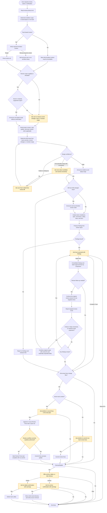

# Architect Review Flow

```mermaid
flowchart TD
    Start([User requests review, audit, or verification]) --> Load[Read review-protocol.md]
    Load --> Preflight[Determine whether scope is track-based or non-track]
    Preflight --> TrackBased{Track-based review?}
    TrackBased -->|Yes| SetupCheck[Verify required Architect context]
    TrackBased -->|No| WarnLimited[Warn that Architect context may be incomplete]
    SetupCheck -->|Missing required context| NotSetup[Halt and ask user to run architect-setup]
    SetupCheck -->|Ready| Parse[Parse tracks.md]
    WarnLimited --> ScopeChoice
    Parse --> ScopeChoice{Review scope supplied or inferable?}
    ScopeChoice -->|No| AskScope[Ask user to choose current changes, track, or revision range]
    ScopeChoice -->|Yes| ScopeConfidence{Exact or uniquely supported scope?}
    ScopeConfidence -->|Yes| AdoptScope[Announce and adopt scope without confirmation]
    ScopeConfidence -->|No| AskScope
    AskScope --> Context[Read project context, style guides, and track context when applicable]
    AdoptScope --> Context
    Context --> Diff[Determine diff scope from track commits, current changes, or revision range]
    Diff --> RangeConfidence{Range confidence?}
    RangeConfidence -->|High| AdoptRange[Announce evidence and adopt range]
    RangeConfidence -->|One plausible range with uncertainty| AskRangeOnce[Ask once about candidate and named uncertainty]
    RangeConfidence -->|Failed or ambiguous| AskDiff[Ask user how to determine review diff]
    AskRangeOnce -->|Yes| Volume
    AskRangeOnce -->|No| AskDiff
    AskDiff --> Diff
    AdoptRange --> Volume{Diff over 300 changed lines?}
    Volume -->|Yes| LargeReview[Announce and use iterative review mode]
    Volume -->|No| Analyze[Analyze plan compliance, style, correctness, safety, tests, and docs]
    LargeReview --> Analyze
    Analyze --> Report[Produce findings-first review report]
    Report --> Findings{Findings found?}
    Findings -->|No| CleanSummary[Report no findings and residual risks]
    Findings -->|Yes| NextAction[Ask how to proceed with findings]
    NextAction -->|Apply fixes| ApplyFixes[Consolidate findings and batch approved fixes by component]
    NextAction -->|Manual Fix| Summary
    NextAction -->|Complete Track| ChangesMade
    ApplyFixes --> FollowUp{Review follow-up needed?}
    FollowUp -->|Yes| TargetedReview[Continue the original review session for one targeted check]
    FollowUp -->|No| ChangesMade
    TargetedReview --> TargetedResult[Report targeted review result]
    TargetedResult --> FollowUpResult{Critical or High unresolved, or material scope expansion?}
    FollowUpResult -->|Yes| EffectiveScope[Combine original scope with review-fix and materially expanded delta]
    EffectiveScope --> Volume
    FollowUpResult -->|No| RemainingFindings{Any findings remain?}
    RemainingFindings -->|Yes| NextAction
    RemainingFindings -->|No| ChangesMade{Did review fixes change files?}
    ChangesMade -->|No| CleanupEligible
    ChangesMade -->|Yes| TrackContext{Active track context?}
    TrackContext -->|No| CommitAsk[Ask whether to commit non-track review fixes]
    TrackContext -->|Yes| TrackRecordAsk[Ask whether to record fixes in the track plan]
    CommitAsk -->|Yes| CommitFixes[Commit review fixes]
    CommitAsk -->|No| CleanupEligible
    TrackRecordAsk -->|No| CleanupEligible
    TrackRecordAsk -->|Yes| TrackPlan[Append or reuse Review Fixes task in plan.md]
    TrackPlan --> TrackCommit{Review workflow commits explicitly authorized?}
    TrackCommit -->|Yes| CommitTrackFixes[Commit fixes and plan update]
    TrackCommit -->|No| MarkReviewTask[Mark Review Fixes task complete with no-commit]
    CommitFixes --> CleanupEligible
    CommitTrackFixes --> CleanupEligible
    MarkReviewTask --> CleanupEligible
    CleanSummary --> ChangesMade
    CleanupEligible -->|No| Summary
    CleanupEligible -->|Yes| CleanupChoice[Offer archive, delete, or skip cleanup]
    CleanupChoice -->|Archive| ArchiveConfirm[Ask for archive confirmation with warnings]
    CleanupChoice -->|Delete| DeleteConfirm[Ask for delete confirmation with warnings]
    CleanupChoice -->|Skip| Summary
    ArchiveConfirm -->|Yes| Archive[Move entire track directory and verify source removal]
    ArchiveConfirm -->|No| Summary
    DeleteConfirm -->|Yes| Delete[Delete track safely]
    DeleteConfirm -->|No| Summary
    Archive --> Summary
    Delete --> Summary

    class AskScope,AskRangeOnce,AskDiff,NextAction,CommitAsk,TrackRecordAsk,TrackCommit,CleanupChoice,ArchiveConfirm,DeleteConfirm human;
    classDef human fill:#fff3cd,stroke:#f0ad4e,stroke-width:2px,color:#111;
```
